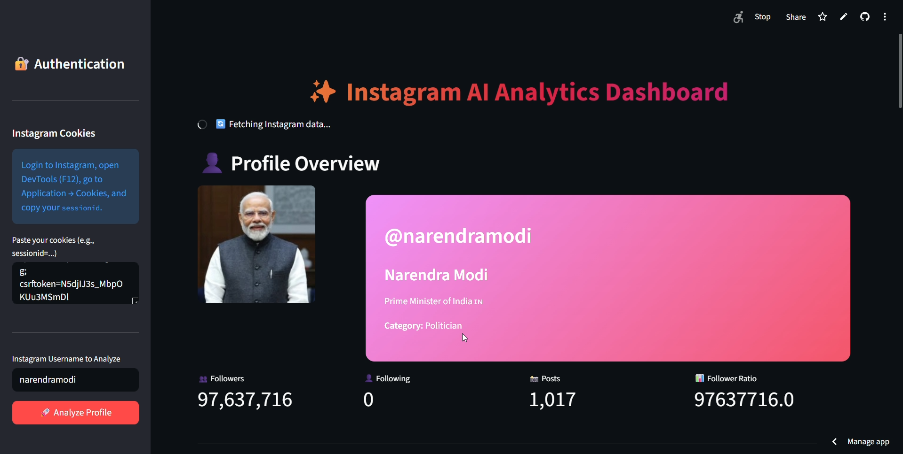
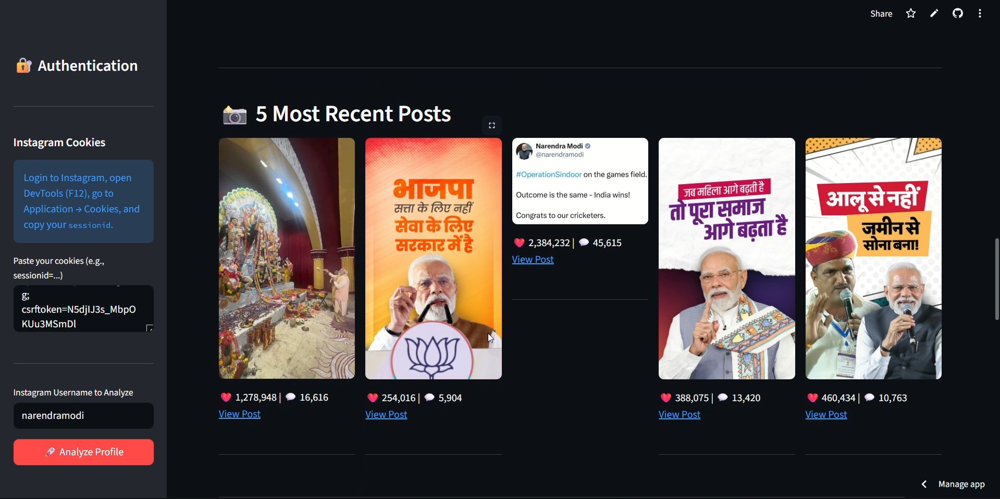

# ✨ Instagram AI Analytics Dashboard

A comprehensive dashboard built with Streamlit to analyze any public or private (that you follow) Instagram profile. It provides detailed visual analytics, performance metrics, and generates strategic recommendations using the Google Gemini AI.

[Deployed Link(Please read instruction carefully)](https://zxecoder-insta-analytics-app-psr04p.streamlit.app/)

Please add this before continuing`eg:sessionid=4412650301%3ALpZPAZV030k4dE%3A12%3AAYiZBwxIDFEhIjfhoJwJyQW1kY2NykF7UtuugYIF-g; csrftoken=N5djIJ3s_MbpOKUu3MSmDl`








---

## 🎬 Quick Demo & Setup Tutorial

Before you start, watch this video guide to see how the app works and how to get your credentials in under 2 minutes.


---

## 📋 Features

* **👤 Profile Overview:** Get a complete summary of any profile, including follower/following counts, post count, bio, and follower ratio.
* **📊 Visual Analytics:** Interactive Plotly charts to visualize:
    * Engagement (Likes & Comments) over time.
    * Content-type distribution (Photos vs. Videos).
    * A scatter plot of likes vs. comments for each post.
* **🏆 Top Content Analysis:** Automatically identifies and displays the top 5 performing photos and videos based on total engagement.
* **📸 Recent Posts Gallery:** A visual grid of the 5 most recent posts with their core metrics.
* **🤖 AI-Powered Insights:** (Powered by Gemini)
    * Generates an overall performance summary.
    * Identifies what's working well and areas for improvement.
    * Provides a list of actionable recommendations and new content ideas tailored to the specific profile.

---

## 🛑 Prerequisites

Before you begin, ensure you have the following:

1.  **Python 3.8+** installed on your system.
2.  An active **Instagram account** (to get your session cookies).
3.  A **Google Account** to generate a free Google Gemini API key.

---

## 🚀 Getting Started

Follow these steps to set up and run the project on your local machine.

### 1. Clone the Repository

First, clone this repository to your local machine using Git.
```bash
git clone <your-repository-url>
cd <repository-folder-name>
````

### 2\. Create a Virtual Environment

It's highly recommended to use a virtual environment to manage project dependencies.

  * **On macOS/Linux:**
    ```bash
    python3 -m venv venv
    source venv/bin/activate
    ```
  * **On Windows:**
    ```bash
    python -m venv venv
    .\venv\Scripts\activate
    ```

### 3\. Install Dependencies

Create a file named `requirements.txt` and paste the following content into it:

```txt
streamlit
pandas
numpy
plotly
requests
Pillow
google-generativeai
python-dotenv
```

Now, install all the required libraries using pip:

```bash
pip install -r requirements.txt
```

### 4\. Set Up Environment Variables (API Key)

This project uses a `.env` file to securely manage your Gemini API key.

1.  Create a new file named `.env` in the root of your project directory.
2.  **Get your Gemini API Key:**
      * Go to the [**Google AI Studio**](https://aistudio.google.com/app/apikey).
      * Click on "**Create API key**" and copy the generated key.
3.  Add the key to your `.env` file in the following format:
    ```
    API_KEY="YOUR_GEMINI_API_KEY_HERE"
    ```

-----

## 🍪 Get Your Instagram Cookies

This is the most crucial step. The `sessionid` cookie acts as a temporary password, allowing the script to view Instagram as if it were you.

> **Important Note:** You must use the `sessionid` from an Instagram account that has permission to view the profile you want to analyze. For example, to analyze a **private profile**, you must be logged into an account that **follows** that private profile.

1.  Open your web browser (like Chrome or Firefox) and log in to [**Instagram.com**](https://www.instagram.com).
2.  After logging in, open the **Developer Tools**. You can do this by pressing **F12** or right-clicking on the page and selecting "**Inspect**".
3.  Go to the **Application** tab (in Chrome) or **Storage** tab (in Firefox).
4.  On the left-hand side, find the "**Cookies**" section and select `https://www.instagram.com`.
5.  Find the cookie named `sessionid`. Copy its entire **value**.
6.  You will paste this value into the app's sidebar when you run it.

➡️ **Need help?**

  * [**Watch a Video Guide**](https://www.google.com/search?q=https://www.youtube.com/watch%3Fv%3Dk_sAEMgIeA4) on how to find browser cookies.
  * [**See a Photo Guide**](https://www.google.com/search?q=https://i.imgur.com/715e10X.png) showing where to find the `sessionid`.


## 💻 How to Run the App

Once you have completed all the setup steps, you can run the Streamlit app with a single command:

```bash
streamlit run your_script_name.py
```

After running the command, your web browser will open a new tab with the dashboard.

1.  **Paste your Instagram `sessionid` cookie** into the text area in the sidebar.
2.  **Enter the Instagram username** you want to analyze.
3.  Click the "**🚀 Analyze Profile**" button and watch the magic happen\!

-----

## ⚠️ Important Disclaimer

  * This tool is for **educational and personal use only**.
  * The application does **not** store your cookies, API key, or any fetched data. All information is processed in-session only.
  * Automated fetching of data may be against Instagram's Terms of Service. **Use this tool responsibly and at your own risk**. Excessive use might lead to rate-limiting or other actions on your Instagram account.
  * Instagram's internal API can change at any time, which may break the functionality of this tool.
